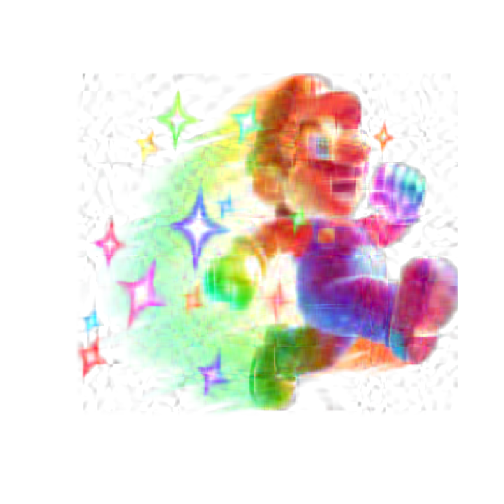

## What is PCA Decomposition

- Any $m x n$ matrix can be decomposed into three matricies.
$$ X = UDV^T $$
- where $U$ is a $m x n$ matrix with orthogonal columns, $D$ is a diagnol $m x n$ matrix, and $V$ is a $n x n$ matrix with orthogonal columns.
- Because of the result of matrix multiplication ( an $a x b$ matrix times a $b x c$ matrix results in a $a x b$ matrix) a subset of the cols of $U$, $D$, and $V$  still result in a $m x n$ matrix 
- If $U$, $D$, and $V$ are generated correctly then the first columns of each explain progressively more of the variation in the matrix $X$.
- This means that a subset of each matrix $U$, $D$, $V$ can be stored and still be used to reproduce the variation represented by $X$.

---

## How this relates to Image Compression

- Raster graphics images are represented by the color (RGB and sometimes alpha) of each individual pixel. Which means every raster image is a set of 3 or 4 $m x n$ matricies and can be decomposed into $U$, $D$, and $V$ matricies.
- A $m x n$ resolution picture with alpha naively requires $4 * (m * n)$ bytes to store.
- A subset of size $c$ from the PCA decomposition takes $4 * c * (m + 1 + n)$ bytes.

--- 

## What does it look like
- A $602 x 480$ image ( seen on last slide) with alpha then takes 1.102 MB to store naively.
- The compressed images from taking only 25 singular vectors requires
.103 MB but maintains the primary character of the image.

---
## Turing it into an App and other thoughts

- I have created an interactive application in shiny that allows the user 
to view an uncompressed image and choose how many singular vectors to include 
then prints the compressed image.

- The application does not currently support dynamic image swapping but it can be
extended to do so very easily (was not included due to danger of overusage of bandwidth).

- The application currently only works with PNG images but extending it to jpeg and 
GIF (other popular raster formats) would just require a few more lines of code.

- Loseless compression algorithms exist and are generally preferred over PCA is almost all situations 
(the image used in the slide actually only requires .312 MB to store as a PNG).

- PCA is a good way to show some basic linear algebra tricks and how one might start
thinking about how they can compress files on a computer.

- Application: "http://warrenferrell.shinyapps.io/DevelopingDataApplicationsCourseProject/"

